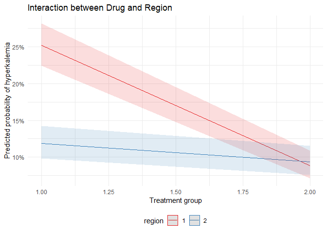

Clinical Analyst Questions
================
Sarahy Martinez

## Question 1

Reading in the data and tidying to ensure easier analysis

``` r
# reading in the data sets 

master_data =
   read_csv(
  "C:/Users/sarah/OneDrive/Documents/Data Science/clinical/master_data.csv",
  na = c("NA", ".", "")
)
```

``` r
adverse_data =
  read_csv("C:/Users/sarah/OneDrive/Documents/Data Science/clinical/t05xc.csv", na = c("NA", ".", "")) %>%   #placed NA for any missing data for this and following data sets
  mutate(hyper = if_else(k >= 5.5, 1,0)) %>%  # assigning values if >= 5.5 then Hyperkalemia = 1 and else =0
  group_by(master_id) %>%  #grouping by id since its the common identifier
 summarise(
    hyper_ae = ifelse(all(is.na(hyper)), 0, max(hyper, na.rm = TRUE)), # assigning  0 if missing also
    .groups = "drop"
  ) #collapsing using summarize to keep patients that have or have not ever experienced high K through the various results

# now adverse data only shows patients who have or have not experienced Hyperkalemia

lab_test_data =
  read_csv("C:/Users/sarah/OneDrive/Documents/Data Science/clinical/t016.csv", na = c("NA", ".", "")) %>% 
   mutate(hyper = if_else(k>= 5.5, 1,0)) %>% 
    group_by(master_id) %>%  #grouping by id since its the common identifier
 summarise(
    hyper_lab = ifelse(all(is.na(hyper)), 0, max(hyper, na.rm = TRUE)), # assigning  0 if missing also
    .groups = "drop"
  )
```

``` r
# merging both adverse and lab test data anf grouping them by master id so that we can have all the data correctly merged
hyper_all = full_join(adverse_data, lab_test_data, by = "master_id") %>%
  mutate(
    hyperkalemia = if_else(
      coalesce(hyper_ae, 0) == 1 | coalesce(hyper_lab, 0) == 1,  #using coalesce to further combining if they =1 then keep hyperklemia as 1 but otherwise make = 0
      1, 
      0
    )
  ) %>%
  select(master_id, hyperkalemia) #just keeping relevant variables
```

``` r
# Merge with master dataset so we can have the hyperklemia variable appear and we are left joining so that we have matching records
final_data = master_data %>%
  left_join(hyper_all, by = "master_id") %>%
  mutate(hyperkalemia = coalesce(hyperkalemia, 0)) %>%  # if we have missing data then set to 0
  select(master_id,hyperkalemia, drug, dose, study_drug_permdisc, pot_b, p_hyperkalemia, gfr,
       age, gender, race_white, race_black, race_asian, ethnicity, region, country,
       site_id, dm, htn, ef, chf_hosp, in_hosp, bmi,
       ace_yn, arb_yn, diur_yn, cvmed_yn, noncv_yn,
       starts_with("dose_v"), starts_with("pot_v"), starts_with("crea_v"))
#keeping only variables that are relevant to the analysis, keeping those that maybe confounders, direct exposures, and outcome variables
```

``` r
#summary stats
total_hyper <- sum(final_data$hyperkalemia == 1, na.rm = TRUE)
total_no_hyper <- sum(final_data$hyperkalemia == 0, na.rm = TRUE)
n_total <- nrow(final_data)
```

Out of the total study population (3445 participants), 479 experienced
hyperkalemia, while 2966 did not.

### Analysis

A. Is the drug associated with hyperkalemia?

``` r
# using binomial regression because binary

fit = glm(hyperkalemia ~ drug, data = final_data,
           family = binomial())
```

``` r
# calculate the odds ratio

fit %>%  
  broom::tidy() %>%  
  mutate(OR = exp(estimate)) %>% 
  select(term, log_OR = estimate, OR, p.value) %>% 
  knitr::kable(digits = 3)
```

| term        | log_OR |    OR | p.value |
|:------------|-------:|------:|--------:|
| (Intercept) | -0.639 | 0.528 |       0 |
| drug        | -0.830 | 0.436 |       0 |

Based on the logistic regression, there is evidence that the drug is
associated with hyperkalemia because the drug p value \< 0.05 which
makes it statistically significant.

B. Does the drug effect depend on geographic region?

``` r
# to test this use logistic regression + interaction

fit_inter = glm(hyperkalemia ~ drug * region,
 data = final_data,
           family = binomial())
```

``` r
# assess interaction via plot 

# plot
plot_model(fit_inter,
           type = "pred",
           terms = c("drug", "region"),
           ci.lvl = 0.95
) +
  labs(
    y = "Predicted probability of hyperkalemia",
    x = "Treatment group",
    title = "Interaction between Drug and Region"
  )
```

<!-- -->

After plotting the regression the lines between region and drug cross
over suggesting a significant interaction. So it appears that drug
effect depends on region.

### Running statistical test for interaction

``` r
# using ANOVA to compare the two models LRT
anova(fit, fit_inter,  #reduced model in the first argument and full model in the second
  test = "LRT")
```

    ## Analysis of Deviance Table
    ## 
    ## Model 1: hyperkalemia ~ drug
    ## Model 2: hyperkalemia ~ drug * region
    ##   Resid. Df Resid. Dev Df Deviance  Pr(>Chi)    
    ## 1      3443     2710.9                          
    ## 2      3441     2659.3  2   51.615 6.195e-12 ***
    ## ---
    ## Signif. codes:  0 '***' 0.001 '**' 0.01 '*' 0.05 '.' 0.1 ' ' 1

The test confirms that at the 5% significance level, we reject the null
hypothesis that the two models are equal to eachother.Since the only
difference between the two models is that an interaction term is added
in the complete model, we reject the hypothesis that there is no
interaction between the age and the sex (p-value = 6.195e-12 or p-value
=0.000 ).
