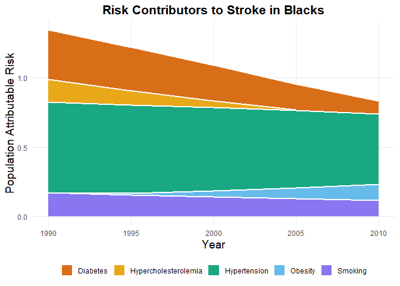

question2_clinical
================
Sarahy Martinez

``` r
knitr::opts_chunk$set(echo = TRUE)
library(tidyverse)
```

    ## ── Attaching core tidyverse packages ──────────────────────── tidyverse 2.0.0 ──
    ## ✔ dplyr     1.1.4     ✔ readr     2.1.5
    ## ✔ forcats   1.0.0     ✔ stringr   1.5.1
    ## ✔ ggplot2   3.5.1     ✔ tibble    3.2.1
    ## ✔ lubridate 1.9.3     ✔ tidyr     1.3.1
    ## ✔ purrr     1.0.2     
    ## ── Conflicts ────────────────────────────────────────── tidyverse_conflicts() ──
    ## ✖ dplyr::filter() masks stats::filter()
    ## ✖ dplyr::lag()    masks stats::lag()
    ## ℹ Use the conflicted package (<http://conflicted.r-lib.org/>) to force all conflicts to become errors

``` r
library(ggridges)
library(hexbin)
library(patchwork)
library(readxl)


theme_set(theme_minimal()+ theme(legend.position = "bottom"))

options(
  
  ggplot2.continuous.colour = "viridis",
  ggplot2.continuous.fill = "viridis"
)

scale_fill_discrete = scale_fill_viridis_d()    

scale_colour_discrete = scale_fill_viridis_d() 
```

``` r
#read in the dataset and rename columns so it's easier to tidy later

stacked_data = read_excel("C:/Users/sarah/OneDrive/Documents/Data Science/clinical/Stacked_column_stroke_blacks_noAF.xlsx",
                           na = c("NA", ".", "")) %>% 
   rename(
    year_1990 = `1990`,
    year_1995 = `1995`,
    year_2000 = `2000`,
    year_2005 = `2005`,
    year_2010 = `2010`
  ) %>%
   janitor::clean_names()
```

``` r
# tidy the data so that we have a column for just one year variable and not multiple 

stacked_data_tidy = 
  pivot_longer(
    stacked_data, 
    year_1990:year_2010,
    names_to = "year",    
    names_prefix = "year_", 
    values_to = "PopulationAttributableRisk") %>% 
   mutate(year = as.numeric(year)) %>%  # changed from character to numeric so year can be treated as value
   janitor::clean_names() # clean names so that variable names follow better naming conventions
                                
#pivot longer will make it easier to graph the risk factors and years separately 
```

# Plots

``` r
ggplot(stacked_data_tidy, aes(x = year, 
                              y = population_attributable_risk, 
                              fill = risk_factors_for_stroke_in_blacks)) +
  geom_area(color = "white", size = 1, alpha = 0.9) +
  scale_fill_manual(values = c(
    "Diabetes" = "#D55E00",
    "Hypercholesterolemia" = "#E69F00",
    "Hypertension" = "#009E73",
    "Obesity" = "#56B4E9",
    "Smoking" = "#7B68EE"
  ),
name = NULL)+
  scale_x_continuous(breaks = seq(190, 2010, 5)) +
  labs(
    title = " Risk Contributors to Stroke in Blacks ",   # <-- now at top
    y = "Population Attributable Risk",                                
    x = "Year"
  ) +
  theme(
    legend.position = "bottom",
    panel.grid.minor = element_blank(),
    axis.title = element_text(size = 14),
    plot.title = element_text(size = 16, face = "bold", hjust = 0.5) # centered title
  )
```

    ## Warning: Using `size` aesthetic for lines was deprecated in ggplot2 3.4.0.
    ## ℹ Please use `linewidth` instead.
    ## This warning is displayed once every 8 hours.
    ## Call `lifecycle::last_lifecycle_warnings()` to see where this warning was
    ## generated.

    ## Warning: Removed 34 rows containing non-finite outside the scale range
    ## (`stat_align()`).

<!-- -->
